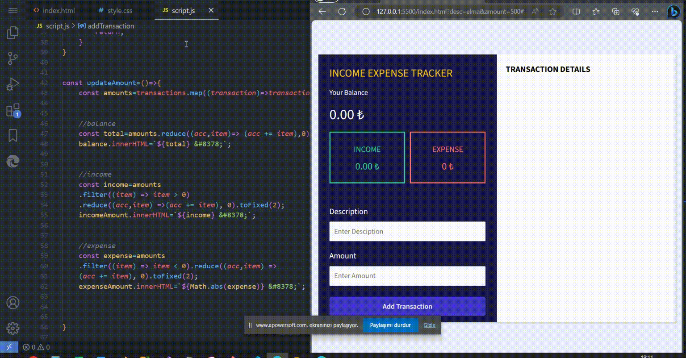

<h1> Income-Expense-Tracker </h1>

The Income-Expense Tracker is a simple web application that helps you keep track of your income and expenses. You can add transactions with descriptions and amounts, and the application will calculate your total balance, income, and expenses.

<h2>Technologies Used</h2>
<h3>The website was developed using the following technologies:</h3>

HTML
CSS
Javascript

